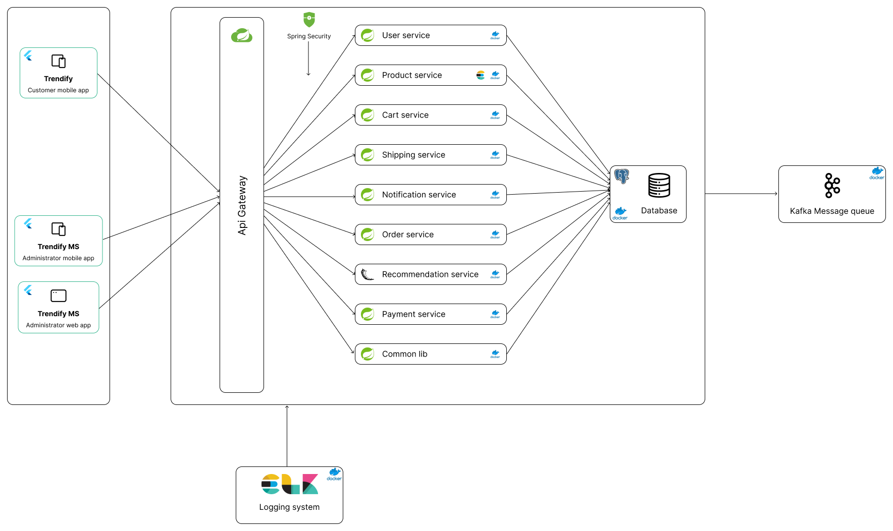

# Trendify MS - E-Commerce Management System

This project is a microservices-based e-commerce management system. The system includes several services to handle different aspects of an e-commerce management, such as user management, product management, and order processing. It uses technologies like Kafka for messaging, Spring Cloud Gateway for API Gateway, and RESTful services for communication between microservices.

## Table of Contents

- [Architecture](#architecture)
- [Services](#services)
    - [User Service](#user-service)
    - [Product Service](#product-service)
    - [Order Service](#order-service)
    - [API Gateway](#api-gateway)
- [Technologies](#technologies)
- [Setup](#setup)
    - [Prerequisites](#prerequisites)
    - [Running Locally](#running-locally)
- [API Endpoints](#api-endpoints)
- [License](#license)

## Architecture



## Services

### User Service

- **Description**: Manages user authentication and profile information.
- **Responsibilities**: User registration, login, and profile management.
- **APIs**: Create user, get user details, update user details, delete user.

### Product Service

- **Description**: Handles product information and inventory management.
- **Responsibilities**: Manage product catalog, track product availability, and update stock levels.
- **APIs**: Add product, get product details, update product details, delete product.

### Cart Service

- **Description**: Manages shopping cart operations.
- **Responsibilities**: Add items to cart, remove items from cart, view cart contents.
- **APIs**: Add to cart, remove from cart, get cart details.

### Payment Service

- **Description**: Manages payment processing for orders.
- **Responsibilities**: Handle payment transactions, verify payment status, manage payment methods.
- **APIs**: Process payment, verify payment, refund payment.

### Order Service

- **Description**: Handles order creation and management.
- **Responsibilities**: Create orders, update order status, track order history.
- **APIs**: Place order, get order details, update order status, cancel order.

### Shipping Service

- **Description**: Manages shipping and delivery of orders.
- **Responsibilities**: Track shipment status, manage shipping methods, update delivery information.
- **APIs**: Create shipment, update shipment status, get shipment details.

### Recommendation Service

- **Description**: Provides product recommendations based on user behavior and preferences.
- **Responsibilities**: Analyze user activity, generate personalized recommendations, manage recommendation algorithms.
- **APIs**: Get recommendations for user, get related products.

### Notification Service

- **Description**: Manages sending notifications to users.
- **Responsibilities**: Send order updates, promotional messages, and alerts to users via email, SMS, or push notifications.
- **APIs**: Send notification, get notification history, update notification preferences.


## Technologies

- Spring Boot
- PostgreSQL database
- Spring Cloud Gateway
- WebSocket
- Kafka
- Docker
- Elasticsearch
- Bucket4j for rate limiting
- Spring Security and JWT for authentication/authorization
- ELK stack for Logging
  - Elasticsearch
  - Logstash
  - Kibana

## Setup

### Prerequisites

- Java 21
- Docker
- Docker Compose

### Running Locally

1. Clone the repository:
   ```sh
   git clone https://github.com/vinguyen1907/trendify-be
   ```
2. Install Docker containers:
    ```sh
    docker-compose up
    ```
3. Build the services:
    ```sh
    mvn clean install
    ```
## License
This project is licensed under the MIT License.